# HTTPS, subdomains, and edge routing in nodeploy

This document explains how nodeploy serves apps over HTTPS on their own subdomains, including setups where one public IP fronts several servers on a LAN. It covers what each piece does, why it was built that way, and how every case flows, with diagrams and example configs.

It was written alongside the six commits that added these features:

| Commit | Change | Why |
|---|---|---|
| `df330a2` | HTTPS with a per-app Let's Encrypt certificate (`proxy.ssl`) | The nginx proxy only spoke plain HTTP. |
| `24d6c38` | Edge proxy routing (`proxy.edge`) | The router forwards 80/443 to one box, but apps run on others. |
| `dedc3d2` | HTTPS apps running on the edge box itself | The edge's HTTPS router takes port 443, so apps there need another port. |
| `ebbced2` | Wildcard and manual routes (`nodeploy edge`), and `nodeploy remove` | Domain-wide defaults, apps nodeploy doesn't deploy, and a clean way to take an app down. |
| `2f44aae` | Real client IPs through the edge (PROXY protocol) | Behind the edge, every HTTPS visitor looked like the edge. |
| `bf9074a` | Certificates via Cloudflare DNS records (`ssl.dns: cloudflare`) | LAN-only servers can't be reached by Let's Encrypt over HTTP. |

---

## Contents

1. [Glossary](#1-glossary)
2. [The config options at a glance](#2-the-config-options-at-a-glance)
3. [Case A: one server, plain HTTP (the starting point)](#3-case-a-one-server-plain-http-the-starting-point)
4. [Case B: HTTPS on a server with a public IP](#4-case-b-https-on-a-server-with-a-public-ip)
5. [Case C: several apps on one server, one subdomain each](#5-case-c-several-apps-on-one-server-one-subdomain-each)
6. [Case D: one public IP, many servers (the edge)](#6-case-d-one-public-ip-many-servers-the-edge)
7. [Case E: HTTPS apps running on the edge itself](#7-case-e-https-apps-running-on-the-edge-itself)
8. [Case F: wildcard and manual routes](#8-case-f-wildcard-and-manual-routes)
9. [Case G: real client IPs over HTTPS](#9-case-g-real-client-ips-over-https)
10. [Case H: LAN-only servers with Cloudflare DNS-01](#10-case-h-lan-only-servers-with-cloudflare-dns-01)
11. [Switching an app between HTTP-01 and DNS-01](#11-switching-an-app-between-http-01-and-dns-01)
12. [Removing an app](#12-removing-an-app)
13. [Safety: how nginx changes are applied](#13-safety-how-nginx-changes-are-applied)
14. [What `nodeploy doctor` checks](#14-what-nodeploy-doctor-checks)
15. [Reference: files and ports on the servers](#15-reference-files-and-ports-on-the-servers)
16. [Known limitations](#16-known-limitations)

---

## 1. Glossary

- **App server (upstream):** the machine an app runs on, set with `server:` in `nodeploy.yml`. In the examples: `192.168.0.12` and `192.168.0.16`.
- **Edge:** the one machine the router forwards public ports 80 and 443 to. It routes each hostname to the app server that runs it. In the examples: `192.168.0.8`.
- **HTTP-01:** Let's Encrypt proves you control a domain by fetching a file from `http://<host>/.well-known/acme-challenge/…`. The server must be reachable from the internet on port 80.
- **DNS-01:** Let's Encrypt proves control by checking a temporary DNS TXT record. The server never needs to be reachable.
- **SNI (Server Name Indication):** the hostname a browser sends in the clear at the start of a TLS connection. The edge reads it to decide where to send the connection, without decrypting anything.
- **SNI passthrough:** forwarding the still-encrypted TLS stream to the server that holds the certificate. The edge never holds certificates for apps on other servers.
- **PROXY protocol:** a one-line header (`PROXY TCP4 <client-ip> …`) sent before the TLS stream, so the receiving server learns the real client address.

## 2. The config options at a glance

Everything lives under `proxy` in each app's `nodeploy.yml`:

```yaml
port: 3000                      # the app's local port (not used by static vite/cra apps)
proxy:
  host: bob.geekofia.cloud      # the hostname nginx serves this app on
  ssl:                          # optional: HTTPS with a Let's Encrypt certificate
    email: you@geekofia.cloud   #   optional: expiry notices (or just `ssl: true`)
    dns: cloudflare             #   optional: DNS-01 instead of HTTP-01 (LAN-only servers)
  edge:                         # optional: the router sends 80/443 to a different box
    server: 192.168.0.8
    # ssh: { user: root }       #   defaults to the app's own ssh block
    # upstream: 192.168.0.12    #   how the edge reaches this server; defaults to `server`
```

Commands involved: `setup` (once per app per server), `deploy` (every release), `doctor`, `remove`, and `edge list | add | remove`.

---

## 3. Case A: one server, plain HTTP (the starting point)

Before these changes, `proxy` produced a single port-80 server block:

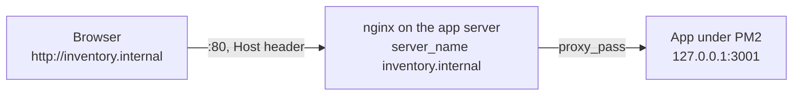

That still works unchanged. The one addition is that every port-80 block now also serves `/.well-known/acme-challenge/` from `/var/www/certbot`, because HTTPS certificate issuance and renewal need it.

---

## 4. Case B: HTTPS on a server with a public IP

**What:** set `proxy.ssl`, and nodeploy gets a certificate for `proxy.host` from Let's Encrypt using HTTP-01, then serves the app over HTTPS.

```yaml
server: 203.0.113.10
port: 3000
proxy:
  host: api.example.com
  ssl:
    email: you@example.com
```

**Why it's built this way:**

- **nodeploy writes all the nginx config itself and uses `certbot certonly` rather than `certbot --nginx`.** `--nginx` edits config files in place, and the next `deploy` overwrites them, which would silently switch HTTPS off. With `certonly`, certbot only writes under `/etc/letsencrypt`.
- **A 443 block pointing at a certificate that doesn't exist yet fails `nginx -t`.** So the first issuance goes through an HTTP-only config first.
- **`--deploy-hook "systemctl reload nginx"`** is saved in the certificate's renewal config, so nginx picks up every automatic renewal.
- **`listen 443 ssl http2`** instead of `http2 on;`, so the config also loads on older nginx (Ubuntu 22.04 ships 1.18).

### First deploy, step by step

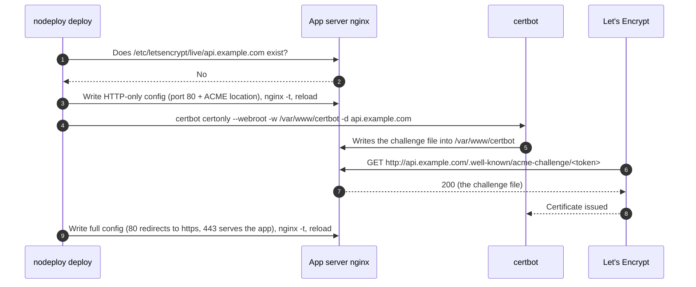

Later deploys find the existing certificate and go straight to the last step.

### The resulting config

```nginx
server {
    listen 80;
    server_name api.example.com;
    location /.well-known/acme-challenge/ { root /var/www/certbot; }   # renewals keep using this
    location / { return 301 https://$host$request_uri; }
}
server {
    listen 443 ssl http2;
    server_name api.example.com;
    ssl_certificate     /etc/letsencrypt/live/api.example.com/fullchain.pem;
    ssl_certificate_key /etc/letsencrypt/live/api.example.com/privkey.pem;
    location / { proxy_pass http://127.0.0.1:3000; ... }   # static apps: root + try_files instead
}
```

---

## 5. Case C: several apps on one server, one subdomain each

**What:** each app gets its own nginx file, keyed on its own `proxy.host`. nginx picks the server block by the `Host` header on port 80, and by SNI on 443. Each app has its own certificate.

```yaml
# app1/nodeploy.yml                # app2/nodeploy.yml
port: 3001                         port: 3002
proxy:                             proxy:
  host: app1.example.com             host: app2.example.com
  ssl: { email: you@example.com }    ssl: { email: you@example.com }
```

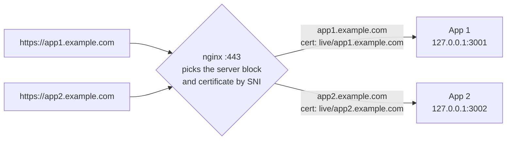

**Why one certificate per app:** HTTP-01 needs no DNS provider credentials, apps can be added or removed independently, and one app's certificate failing doesn't affect the others.

---

## 6. Case D: one public IP, many servers (the edge)

**The situation that prompted this:** the office router forwards public ports 80 and 443 to `192.168.0.8`, but `bob.geekofia.cloud` runs on `192.168.0.12`. Let's Encrypt's HTTP-01 request reached `.8`'s default site and got a 404, so the certificate couldn't be issued. More servers (`.16`, …) and more domains (`*.brothersequipment.in`) were planned.

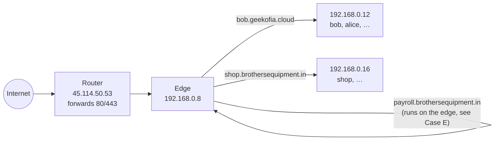

**What:** set `proxy.edge` on each app, and nodeploy configures the edge as well as the app server:

```yaml
server: 192.168.0.12
proxy:
  host: bob.geekofia.cloud
  ssl: { email: bob@geekofia.cloud }
  edge:
    server: 192.168.0.8
```

The edge routes by hostname using two mechanisms:

- **Port 80:** an ordinary nginx server block per host (`sites-available/edge.<host>.conf`) that proxies to the app server's nginx. This also carries Let's Encrypt's HTTP-01 requests, so every app server gets and renews its own certificate as if it had its own public IP.
- **Port 443:** SNI passthrough using nginx's `stream` module. The edge reads the hostname from the TLS handshake and forwards the still-encrypted stream using a one-line route file per host (`stream.d/nodeploy-routes/<host>.conf`). The edge never decrypts traffic or holds these apps' certificates.

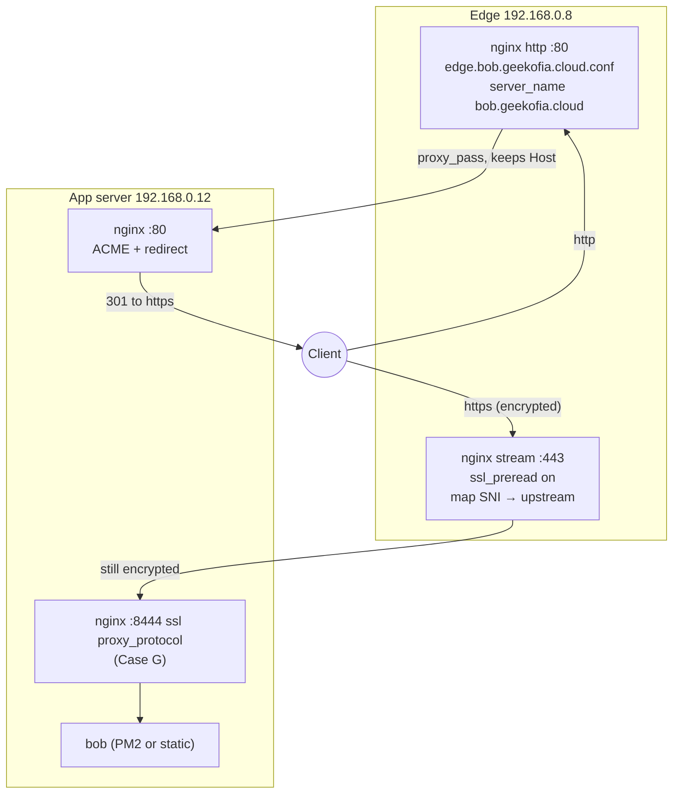

### Setup, once per edge

`nodeploy setup` on an app with `proxy.edge` prepares the edge. It's shared by every app routed through it and safe to re-run from any of them:

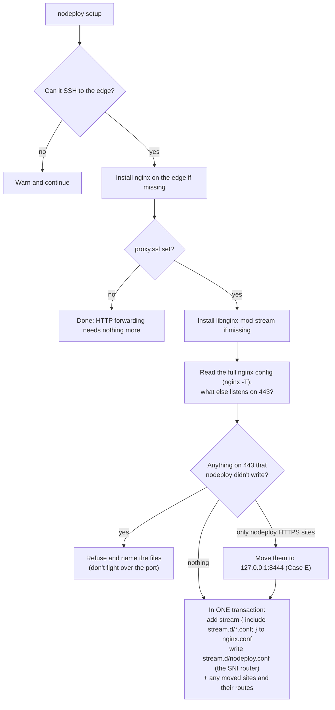

### Every deploy

The edge step comes in two halves around the app's own nginx step, for two reasons. The port-80 forward must exist before certificate issuance, so challenges can reach the app server. The HTTPS route must only point at a listener that already exists.

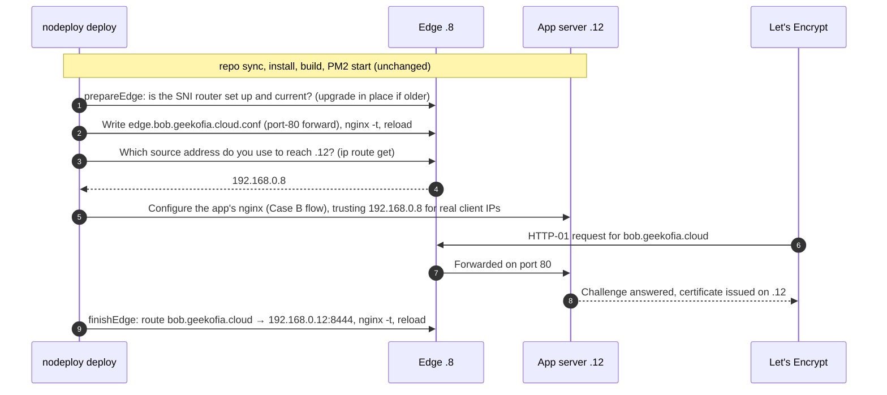

**Why the per-app files are named after the hostname rather than the service name:** hostnames are unique by definition, but two apps on different servers could easily both be called `api`. Apps deployed from different repos never edit the same file.

---

## 7. Case E: HTTPS apps running on the edge itself

**Problem:** once the SNI router owns port 443 on `.8`, an HTTPS app deployed onto `.8` can't also listen there.

**What:** no new config. Deploy the app to `.8` like any other app, without `edge` (nodeploy rejects `edge.server` equal to `server`). `deploy` sees that its target is an edge (`/etc/nginx/stream.d/nodeploy.conf` exists), and:

- the app's HTTPS block listens on **`127.0.0.1:8444`** (PROXY protocol, trusted only from loopback) instead of 443;
- a route `<host> 127.0.0.1:8444;` sends that hostname back to the same box.

Both are written in the same transaction, so the router never points at a listener that isn't there. If a box already has nodeploy HTTPS sites on 443 when it becomes an edge, `setup` moves them the same way (see the setup diagram above).

```yaml
server: 192.168.0.8
port: 8080
proxy:
  host: payroll.brothersequipment.in
  ssl: { email: you@brothersequipment.in }
```

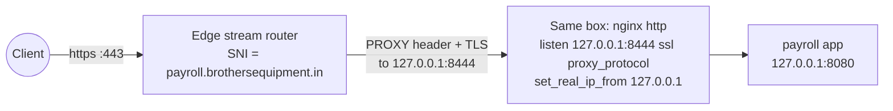

(Apps moved by the version from `dedc3d2`, before real-IP support, listen on `127.0.0.1:8443`. They keep working without real client IPs until redeployed, and `doctor` flags them.)

---

## 8. Case F: wildcard and manual routes

**What:** `nodeploy edge` manages edge routes directly, without deploying anything:

```sh
nodeploy edge list
nodeploy edge add '*.brothersequipment.in' 192.168.0.16     # whole domain → one server
nodeploy edge add legacy.geekofia.cloud 192.168.0.20        # an app nodeploy doesn't deploy
nodeploy edge add status.geekofia.cloud 192.168.0.20 --http-only
nodeploy edge remove '*.brothersequipment.in'
```

**Why:** per-app routes cover apps deployed with `proxy.edge`. A wildcard is a domain-wide default: any subdomain without its own route goes to that server, including Let's Encrypt's challenges. Apps under that domain can then use `ssl` without an `edge` block, and servers nodeploy doesn't manage can be routed too.

**Precedence:** both nginx's `server_name` (port 80) and the stream `map` with `hostnames` (port 443) prefer an exact host over any wildcard. Per-app routes always win.

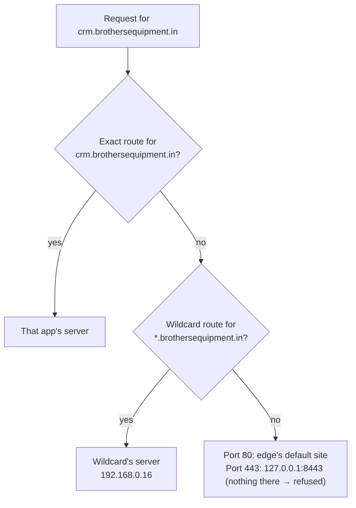

`*.example.com` does not match the bare `example.com`, so add that as its own route. Wildcard route files are stored as `_wildcard.<domain>` (e.g. `edge._wildcard.brothersequipment.in.conf`), because a `*` in a file name would act as a glob pattern, and `_` can't appear in a real hostname. Hosts and upstreams are validated before they reach any config or shell command, and routing the edge to itself (a proxy loop) is refused.

---

## 9. Case G: real client IPs over HTTPS

**Problem:** with SNI passthrough, the edge can't add `X-Forwarded-For` to encrypted traffic, so every HTTPS visitor looked like `192.168.0.8` to the app (or `127.0.0.1` for apps on the edge).

**Why not simply turn on PROXY protocol?** A listener either always expects the PROXY header or never does. Adding it to the app server's 443 would break LAN clients connecting to it directly. And nginx's `proxy_protocol on` can't be set per route on the edge's router, which also serves servers that don't expect the header.

**What:**

- **App servers behind an edge keep 443 exactly as before** and gain a second listener on **8444** that expects the PROXY header. nginx's `realip` trusts the header only from the edge's exact address, which nodeploy looks up on the edge (`ip route get`) at deploy time.
- **The edge's router always sends the header**, then splits by the route's port: routes on `:8444` go straight to the app server, and every other route goes through a loopback hop (`127.0.0.1:9443`) that strips the header first.
- **Port 80** on app servers behind an edge trusts the edge's `X-Forwarded-For`, from the edge's address only.

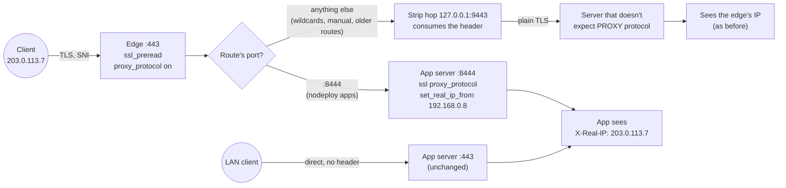

The edge's router config (`/etc/nginx/stream.d/nodeploy.conf`):

```nginx
map $ssl_preread_server_name $nodeploy_upstream {
    hostnames;
    include /etc/nginx/stream.d/nodeploy-routes/*.conf;   # e.g. "bob.geekofia.cloud 192.168.0.12:8444;"
    default 127.0.0.1:8443;
}
map $nodeploy_upstream $nodeploy_first_hop {
    ~:8444$ $nodeploy_upstream;       # expects the header: send it directly
    default 127.0.0.1:9443;           # doesn't: go via the strip hop
}
server { listen 443; ssl_preread on; proxy_protocol on; proxy_pass $nodeploy_first_hop; }
server { listen 127.0.0.1:9443 proxy_protocol; ssl_preread on; proxy_pass $nodeploy_upstream; }
```

And on the app server:

```nginx
server {
    listen 443 ssl http2;                         # direct LAN clients, unchanged
    listen 8444 ssl http2 proxy_protocol;         # the edge only
    set_real_ip_from 192.168.0.8;                 # the edge's exact address, never a range
    real_ip_header proxy_protocol;
    ...
}
```

**Can the header be spoofed?** No. Tested against .8's real nginx: a hand-crafted header claiming `6.6.6.6` was honoured only from the trusted address. From any other LAN machine, nginx kept the sender's own address. That's why the trusted address must be the edge's exact IP.

Existing edges upgrade on the next deploy: `prepareEdge` rewrites an older router in place, and each app's route moves to `:8444` when that app is redeployed.

---

## 10. Case H: LAN-only servers with Cloudflare DNS-01

**Problem:** HTTP-01 needs Let's Encrypt to reach the server on port 80 from the internet. A server with no public IP or port forwarding can't offer that.

**What:** with `ssl.dns: cloudflare`, the certificate is issued through certbot's Cloudflare plugin, which proves control of the domain with a temporary `_acme-challenge` TXT record. No inbound connection is involved, with or without an edge.

```yaml
server: 192.168.0.12
port: 3000
proxy:
  host: hr.geekofia.cloud          # Cloudflare A record hr → 192.168.0.12 (DNS only, grey cloud)
  ssl:
    email: you@geekofia.cloud
    dns: cloudflare
```

```sh
CLOUDFLARE_API_TOKEN=... nodeploy setup     # token: "Edit zone DNS" template, Zone → DNS → Edit
nodeploy deploy
```

**Why the token is handled this way:**

- **It's never in `nodeploy.yml`,** because that file gets committed.
- **It's stored on the server,** because certbot needs it for every automatic renewal, not just the first issuance.
- **One file per hostname** (`/etc/letsencrypt/nodeploy/cloudflare-<host>.ini`, root-only), so apps on different Cloudflare accounts each use their own token.
- **It's sent over SSH stdin and read into curl through a builtin `printf`,** so it never appears in any process's command line.

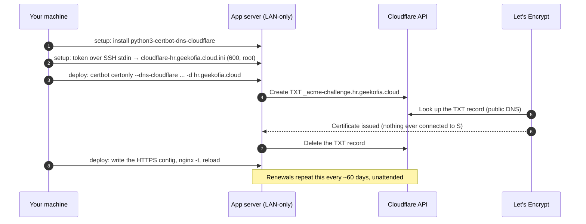

`nodeploy doctor` asks Cloudflare whether the stored token is still active, because a revoked or expired token would otherwise only surface when a renewal fails. `nodeploy remove --purge` deletes the stored token.

---

## 11. Switching an app between HTTP-01 and DNS-01

**Problem:** certbot records the method a certificate was issued with in its renewal config, and every renewal reuses it. Switching an existing app to `dns: cloudflare` without re-issuing would leave renewals on HTTP-01, which then fails on a LAN-only server.

**What:** every HTTPS deploy reads the existing certificate's `authenticator` from `/etc/letsencrypt/renewal/<host>.conf` and compares it with the config:

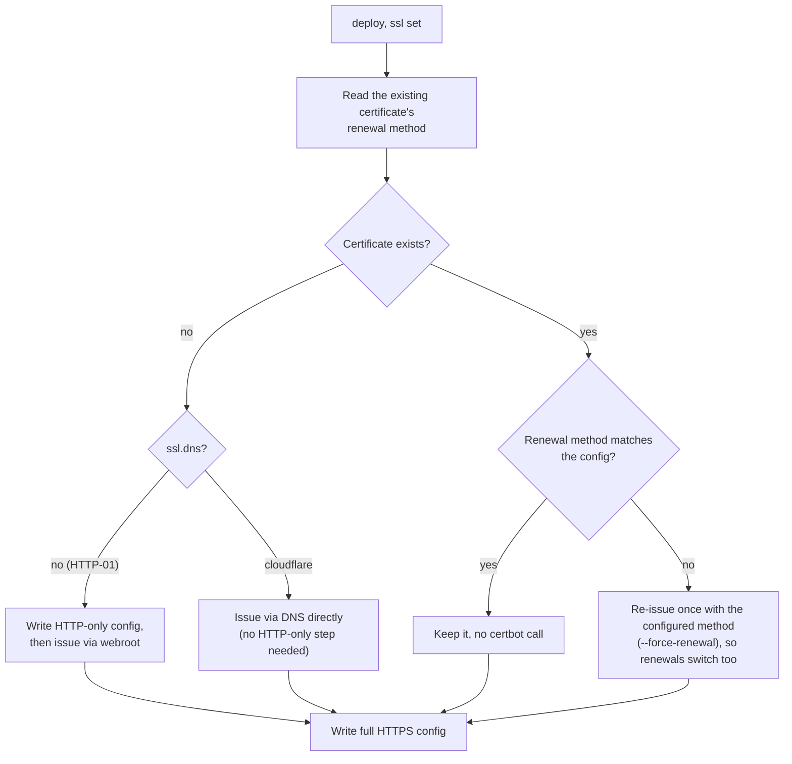

---

## 12. Removing an app

```sh
nodeploy remove            # asks you to type the service name
nodeploy remove --purge    # also deletes deploy_path, the certificate, the Cloudflare token, the deploy key
nodeploy remove --yes      # skip the prompt (required without a terminal)
```

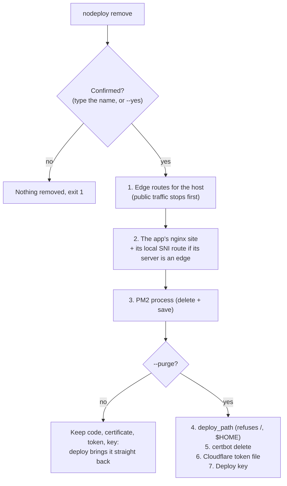

**Why this order:** traffic stops at the edge before the app disappears. The certificate is deleted only after the nginx site that references it, otherwise `nginx -t` would start failing. Steps are independent: if one fails (e.g. the edge is unreachable), the rest still run, and re-running `remove` finishes the job.

---

## 13. Safety: how nginx changes are applied

The edge is shared by every app routed through it, so one bad file left on it would break the next reload for all of them. Every edge change, and every change on an app server that's also an edge, goes through a single generated bash script that is all-or-nothing:

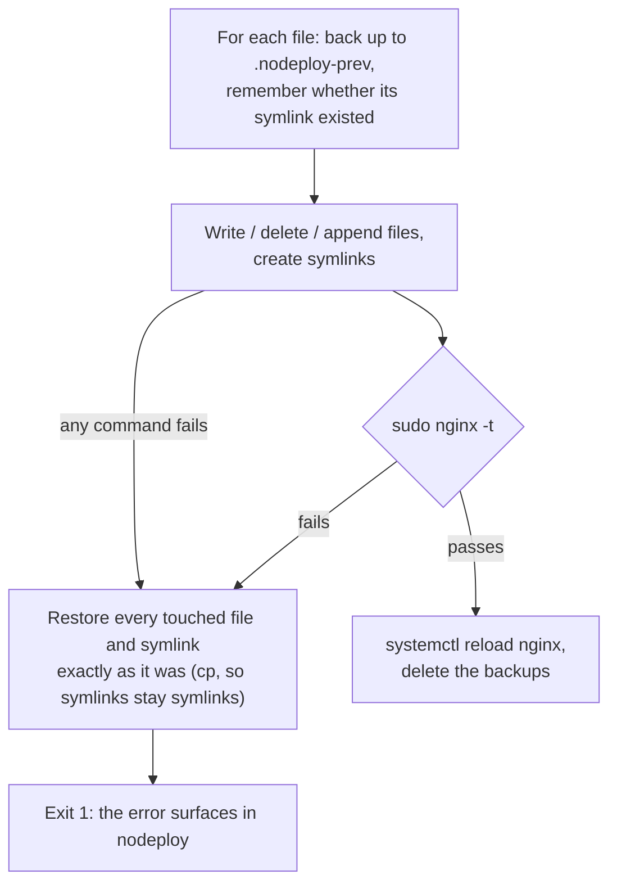

This was tested in real bash for success, re-run (no duplicated `stream {}` block), `nginx -t` failure, and a failure partway through.

---

## 14. What `nodeploy doctor` checks

| Check | Shown when | Fails when |
|---|---|---|
| certbot | `proxy.ssl` | certbot isn't installed on the server |
| TLS certificate | `proxy.ssl` | expires in under 14 days (renewal normally happens at 30, so it's failing). Missing before the first deploy is only a warning |
| Cloudflare DNS | `ssl.dns: cloudflare` | no stored token, or Cloudflare says it isn't active |
| Edge routing | `proxy.edge` | the edge has no SNI router (for `ssl`). Warns if routes are missing or still on the old non-PROXY-protocol path |
| Edge → upstream | `proxy.edge` | the edge can't reach the app server on port 80 |
| Edge → upstream :8444 | `proxy.edge` + `ssl` | warns if the edge can't reach 8444 (a firewall on the app server) |
| Edge routing (local) | `ssl` on a server that is an edge | warns if the host isn't routed to `127.0.0.1:8444` yet |

---

## 15. Reference: files and ports on the servers

**On an app server:**

| Path | Purpose |
|---|---|
| `/etc/nginx/sites-available/<service>.conf` (+ `sites-enabled/` symlink) | The app's site |
| `/var/www/certbot/` | HTTP-01 challenge files |
| `/etc/letsencrypt/live/<host>/` | The app's certificate |
| `/etc/letsencrypt/renewal/<host>.conf` | certbot's renewal config (its `authenticator` records the challenge method) |
| `/etc/letsencrypt/nodeploy/cloudflare-<host>.ini` | Cloudflare token, root-only (`ssl.dns: cloudflare`) |
| `$HOME/.ssh/<service>_deploy_key` | Deploy key |

**On an edge:**

| Path | Purpose |
|---|---|
| `/etc/nginx/nginx.conf` | Gains a top-level `stream { include /etc/nginx/stream.d/*.conf; }` |
| `/etc/nginx/stream.d/nodeploy.conf` | The SNI router (rewritten on upgrade) |
| `/etc/nginx/stream.d/nodeploy-routes/<host>.conf` | One HTTPS route per host (`_wildcard.<domain>.conf` for wildcards) |
| `/etc/nginx/sites-available/edge.<host>.conf` (+ `sites-enabled/`) | One port-80 forward per host |

**Ports:**

| Port | Where | Used for |
|---|---|---|
| 80 | every nginx | HTTP, ACME challenges, redirect to HTTPS |
| 443 | app servers / edge | direct HTTPS on app servers; the SNI router on the edge |
| 8444 | app servers behind an edge | HTTPS from the edge, with PROXY protocol |
| 127.0.0.1:8444 | the edge | HTTPS apps running on the edge, with PROXY protocol |
| 127.0.0.1:9443 | the edge | the strip hop, for routes that don't expect the header |
| 127.0.0.1:8443 | the edge | default for unrouted hostnames; apps moved before real-IP support |

---

## 16. Known limitations

- **Cleanup when an app is retired** isn't automatic. `nodeploy remove` handles it.
- **Unrouted hostnames on 443:** these go to `127.0.0.1:8443` on the edge. If an older HTTPS app still listens there, the visitor gets that app's certificate and a name-mismatch warning.
- **`*.domain` doesn't match the bare domain.** Add it as a separate route.
- **Only Cloudflare DNS-01.** Other DNS providers, and wildcard certificates, aren't supported.
- **IPv4 only** for the edge's upstream addresses and the trusted-address lookup.
- **`setup` targets Debian/Ubuntu** (`apt`, `systemd`), like the rest of nodeploy.
